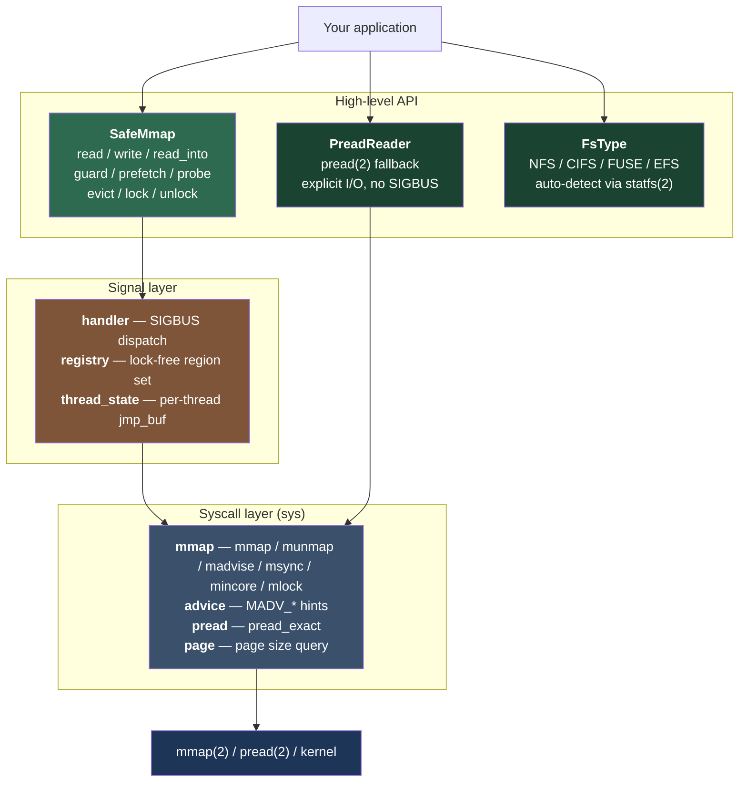

# mmap-shield

[](https://crates.io/crates/mmap-shield)
[](https://docs.rs/mmap-shield)
[](https://github.com/mauricemojito/mmap-shield/actions)
[](LICENSE-MIT)

**Memory-mapped file access that won't kill your process.**

On network filesystems like NFS and Amazon EFS, a page fault on an mmap'd region can raise `SIGBUS` and crash your entire application. No error code, no chance to recover — just dead. `mmap-shield` catches those faults and turns them into regular `Err` values you can handle like any other I/O error.

Built for anyone working with large files on shared or cloud storage where the network can hiccup at any moment.

---

## Why this exists

The standard approach to reading large files in Rust is memory mapping. It's fast, it's zero-copy, and it works great — until the storage disappears mid-read. On local SSD, that never happens. On NFS, EFS, or any network mount, it happens more than you'd like.

When it does, the kernel delivers `SIGBUS`. Your process dies. Your HTTP request returns 502. Your batch job restarts from scratch. There's no `Result`, no retry, no graceful degradation.

`mmap-shield` fixes this by installing a signal handler that catches `SIGBUS` from your mapped regions and converts it into a recoverable error. You keep using mmap for what it's good at (lazy loading, minimal memory footprint, random access into huge files) without the "surprise crash" risk.

## Quick start

```rust
use mmap_shield::{SafeMmap, AccessError, Advice};

let mmap = SafeMmap::open("large_file.bin")?;
mmap.advise(Advice::Random)?;

match mmap.read(0..1024, |bytes| bytes.to_vec()) {
    Ok(data) => process(&data),
    Err(AccessError::Sigbus { fault_address }) => {
        eprintln!("storage unavailable at {:#x}", fault_address);
        // fall back, retry, return 503, whatever makes sense
    }
    Err(e) => return Err(e.into()),
}
```

## Features

**What you get out of the box:**

- **SIGBUS recovery** — page faults become `Err(AccessError::Sigbus)`, not process death
- **Read and write support** — `SafeMmap::read()`, `write()`, `read_into()`
- **Scoped guards** — `guard()` for multiple reads with amortized setup cost
- **Timed prefetch** — `prefetch_with_timeout()` catches NFS stalls before they block your thread
- **Eviction control** — `evict()` releases pages you're done with, `prefetch()` hints what's coming next
- **Page residency queries** — `resident_pages()` via `mincore` tells you what's cached without touching it
- **Memory pinning** — `lock_range()` / `unlock_range()` for hot data
- **Poison tracking** — after N faults, the mapping auto-rejects further access
- **Filesystem detection** — `FsType::detect()` identifies NFS, CIFS, FUSE, EFS
- **pread fallback** — `PreadReader` offers the same API over explicit syscalls, zero SIGBUS risk
- **Metrics callback** — `on_event()` for observability (faults, poisoning, timeouts)
- **Builder pattern** — full control over protection, visibility, offset, length, populate

**What it costs:**

The protection overhead is ~125 ns per read (the `sigsetjmp` + C trampoline cost). For reads above 64 KB, that's under 4% overhead. At 1 MB reads it's effectively zero. See [benchmarks](#benchmarks) below.

## Usage patterns

### Simple read-only access

```rust
use mmap_shield::SafeMmap;

let mmap = SafeMmap::open("data.bin")?;
let header = mmap.read(0..64, |bytes| {
    let mut buf = [0u8; 64];
    buf.copy_from_slice(bytes);
    buf
})?;
```

### Direct buffer copy

```rust
let mmap = SafeMmap::open("data.bin")?;
let mut buf = vec![0u8; 4096];
mmap.read_into(0, &mut buf)?;
```

### Writable shared mapping

```rust
let mmap = SafeMmap::options()
    .writable(true)
    .shared(true)
    .open("data.bin")?;

mmap.write(0, b"hello")?;
mmap.flush(0, 5, false)?; // sync to disk
```

### Partial mapping with offset

```rust
let mmap = SafeMmap::options()
    .offset(4096)        // skip first page
    .len(1024 * 1024)    // map 1 MB
    .open("large_file.bin")?;
```

### Chunk-based access with prefetch

```rust
use mmap_shield::{SafeMmap, Advice};
use std::time::Duration;

let mmap = SafeMmap::open("large_file.bin")?;
mmap.advise(Advice::Random)?;

let chunk_offset = 1024 * 256;
let chunk_len = 1024 * 256;

// Prefetch with a 5-second deadline — catches NFS stalls:
mmap.prefetch_with_timeout(chunk_offset, chunk_len, Duration::from_secs(5))?;

// Read the chunk:
let data = mmap.read(chunk_offset..chunk_offset + chunk_len, |b| b.to_vec())?;

// Release pages when done:
mmap.evict(chunk_offset, chunk_len)?;
```

### Auto-detect network filesystem and choose strategy

```rust
use mmap_shield::{SafeMmap, fallback::PreadReader, sys::fs_detect::FsType};

let path = "/mnt/efs/data.bin";
let fs = FsType::detect(path)?;

if fs.is_network() {
    // Explicit I/O — no SIGBUS possible, proper error codes
    let reader = PreadReader::open(path)?;
    let data = reader.read(0..1024, |b| b.to_vec())?;
} else {
    // Fast path — mmap with protection
    let mmap = SafeMmap::open(path)?;
    let data = mmap.read(0..1024, |b| b.to_vec())?;
}
```

### Observability

```rust
use mmap_shield::SafeMmap;
use std::sync::Arc;

let mmap = SafeMmap::options()
    .on_event(Arc::new(|event| {
        // send to your metrics system
        println!("mmap event: {event:?}");
    }))
    .max_sigbus(5)
    .open("data.bin")?;
```

## Architecture



## How it works

The core trick is `sigsetjmp` / `siglongjmp`. Before accessing mapped memory, we set a recovery checkpoint. If `SIGBUS` fires, the signal handler jumps back to that checkpoint and the function returns `Err` instead of crashing.

The tricky parts that took a while to get right:

1. **`sigsetjmp` can't be wrapped in a function** — the function that calls it must stay on the stack when `siglongjmp` fires. We use a C trampoline that calls `sigsetjmp`, then invokes a Rust closure via function pointer.

2. **Signal handlers can't use locks or `thread_local!`** — they're not async-signal-safe. We use `pthread_getspecific` for per-thread state and an `AtomicPtr` to an immutable snapshot for the region registry.

3. **Retired region snapshots can't be freed immediately** — a signal handler on another core might still be reading the old one. We use two-generation deferred reclamation.

4. **`siglongjmp` skips Rust destructors** — any `Drop` types alive at the fault point will leak. This is a resource leak, not memory corruption. The API is designed to minimize this: `read()` takes a closure, `read_into()` copies to a caller-owned buffer.

## Benchmarks

Measured on Apple M4 Pro, macOS, 64 MB test file (pages hot in cache).

### Protection overhead

| Operation | Time |
|---|---|
| Bare metal pointer deref (1 byte) | 0.27 ns |
| `SafeMmap::read()` (1 byte) | 126 ns |
| `SafeMmap::guard().read()` (1 byte) | 125 ns |

The ~125 ns is the fixed cost of `sigsetjmp` + C trampoline per read call.

### 4 KB read comparison

| Method | Time | Throughput | vs Bare Metal |
|---|---|---|---|
| Bare metal ptr | 204 ns | 18.7 GiB/s | — |
| `unsafe as_slice()` | 207 ns | 18.4 GiB/s | +1% |
| `SafeMmap::read()` | 338 ns | 11.2 GiB/s | +66% |
| `SafeMmap::read_into()` | 375 ns | 10.2 GiB/s | +84% |
| `pread()` fallback | 643 ns | 5.9 GiB/s | +215% |

### Where the overhead disappears

| Read size | Bare metal | SafeMmap | Overhead |
|---|---|---|---|
| 64 B | 4.4 ns | 137 ns | 31x |
| 512 B | 27 ns | 158 ns | 5.8x |
| 4 KB | 209 ns | 338 ns | 1.6x |
| 64 KB | 3.4 µs | 3.5 µs | **1.04x** |
| 1 MB | 53 µs | 53 µs | **~1x** |

**Above 64 KB, protection overhead is noise.** At 1 MB it's essentially free.

### Random 256 KB access pattern

| Method | Time | Throughput |
|---|---|---|
| Bare metal | 13.4 µs | 18.1 GiB/s |
| SafeMmap | 14.1 µs | 17.3 GiB/s |
| pread | 32.4 µs | 7.5 GiB/s |

SafeMmap is **5% slower than bare metal, 2.3x faster than pread**.

### Advisory & prefetch operations

| Operation | Time |
|---|---|
| `prefetch()` (MADV_WILLNEED, 4 KB) | 146 ns |
| `probe()` (4 KB) | 126 ns |
| `resident_pages()` (mincore, 4 KB) | 479 ns |
| `evict()` + re-read (4 KB) | 1.5 µs |
| `prefetch_with_timeout()` (4 KB) | 18.3 µs |

`prefetch_with_timeout()` is expensive (~18 µs) due to thread spawn + join. Use `prefetch()` for fire-and-forget hints, reserve `prefetch_with_timeout()` for when you actually need the stall guarantee.

## Safety

This crate uses `unsafe` internally for signal handling and raw pointer access. The public API is safe with two exceptions:

- `as_slice()` / `as_mut_slice()` — marked `unsafe` because accessing the returned slice can trigger SIGBUS. Use `read()` / `read_into()` for protected access.

Every `unsafe` block has a `// SAFETY:` comment. The crate passes clippy with no warnings, has zero doc link warnings, and includes 107+ tests covering adversarial edge cases (integer overflow, concurrent stress, file mutation under mapping, signal handler correctness).

## Platform support

| Platform | Status |
|---|---|
| Linux x86_64 | Supported |
| Linux aarch64 | Supported |
| macOS x86_64 | Supported |
| macOS aarch64 (Apple Silicon) | Supported |
| Windows | Not supported (`compile_error!`) |

Requires a C compiler for the `sigsetjmp` shim (6 lines of C, built via `cc`).

## License

Licensed under either of

- Apache License, Version 2.0 ([LICENSE-APACHE](LICENSE-APACHE) or <http://www.apache.org/licenses/LICENSE-2.0>)
- MIT license ([LICENSE-MIT](LICENSE-MIT) or <http://opensource.org/licenses/MIT>)

at your option.

## Contributing

Contributions welcome. Please open an issue before submitting large changes.

If you find a soundness issue, please report it — we take those seriously.
